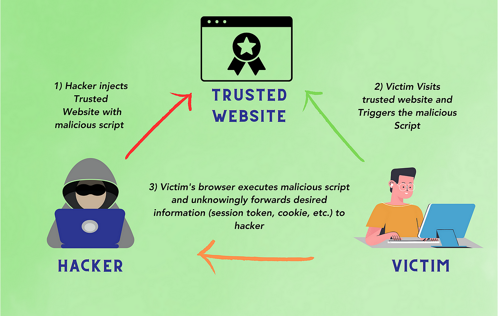

# 🌸 **VulnBloom** — Advanced XSS Scanner


<p align="center">
  
  
  
  
</p>

<p align="center">
  <b>VulnBloom</b> is a powerful, colorful, and modern XSS scanner for bug bounty hunters and security professionals.
  <br>
  <i>Finds XSS vulnerabilities by leveraging historical URLs, subdomain enumeration, and custom payloads with advanced resume capabilities.</i>
</p>

---

## 🌟 **Features**

| 🚀 Feature                        | ✅ Description                                                                 |
|-----------------------------------|-------------------------------------------------------------------------------|
| 🔎 Subdomain Enumeration          | Collects subdomains from crt.sh, hackertarget, DNS brute-force, Amass, Subfinder, and more |
| 🕰️ Historical URL Collection      | Fetches thousands of URLs from archive.org and urlscan.io                     |
| 🎨 Colorful CLI                   | Beautiful, animated output with progress bars and color coding                |
| 🧹 Deduplication & Validation     | Removes duplicate/invalid subdomains and URLs, strict domain matching         |
| 💉 Custom Payloads                | Loads your XSS payloads from `payloads.txt`                                   |
| ⚡ Multi-threaded Scanning         | Fast, concurrent XSS testing with configurable thread count                   |
| 🧪 XSS Type Detection             | Detects reflected, stored, and DOM-based XSS, context-aware reporting         |
| 📊 Real-time HTML Report          | Generates a live, clickable, and detailed HTML report                         |
| 🔄 **Resume Functionality**       | **NEW!** Resume scans from where they left off after interruption             |
| 🛡️ **Error Handling & Logging**   | **NEW!** Comprehensive error logging and graceful failure handling             |
| 📈 Progress Tracking              | Shows scan progress for every URL and payload                                 |
| 🧰 **DNS Brute-force Progress**   | **NEW!** Live progress bar, ETA, and interrupt support for DNS brute-force    |
| 🖥️ **Main Menu & Update Tool**    | **NEW!** User-friendly menu with 'Update Tool' option and clean Ctrl+C exit   |
| 🎯 **Command-Line Arguments**     | **NEW!** Control thread count and other options via CLI                       |

---

<div align="center">
  
</div>

---

## 🚀 **Quick Start**

```bash
# 1. Clone the repo
$ git clone https://github.com/fagun18/VulnBloom.git
$ cd VulnBloom

# 2. Add your payloads
$ nano payloads.txt  # or use your favorite editor

# 3. (Optional) Add a big DNS wordlist as subs-dnsbruter.txt for maximum subdomain coverage

# 4. Run the scanner
$ python VulnBloomXSS.py

# 5. Or with custom thread count (recommended for low memory)
$ python VulnBloomXSS.py --threads 4
```

- Enter your target domain when prompted (e.g., `example.com`).
- Use the main menu to resume, start new, update the tool, or exit.

---

## 🖥️ **Main Menu & Update Tool**

- On launch, you'll see a menu:
  - Resume previous scan
  - Start new scan
  - Update Tool (pulls latest from git and restarts automatically)
  - Exit
- Press Ctrl+C at the menu for a clean exit (no traceback).

---

## 🧰 **DNS Brute-force Progress & Interrupt**

- When using DNS brute-force (with `subs-dnsbruter.txt`), you'll see a live progress bar:
  - Shows how many prefixes checked, percent complete, subdomains found, and ETA.
  - Press Ctrl+C at any time to stop brute-forcing and keep the subdomains found so far.

---

## 🎛️ **Command-Line Options**

```bash
# Basic usage
python VulnBloomXSS.py

# Control thread count (recommended: 2-8 for stability)
python VulnBloomXSS.py --threads 4

# Low memory usage
python VulnBloomXSS.py --threads 2

# High performance (use with caution)
python VulnBloomXSS.py --threads 16
```

---

## 🔄 **Resume Functionality**

**VulnBloom now supports resuming interrupted scans!**

### How It Works:
1. **Start a scan**: `python VulnBloomXSS.py --threads 4`
2. **Interrupt it**: Press `Ctrl+C` or let it be killed
3. **Resume**: Run the same command again
4. **Choose**: You'll be prompted to resume or start new

### Supported Scan Types:
- ✅ **Main XSS Scan** - Resume from last tested URL/payload
- ✅ **Stored XSS Scan** - Resume stored XSS testing
- ✅ **DOM XSS Scan** - Resume DOM-based XSS testing

### State Files:
- `scan_state.json` - Main scan progress
- `scan_state_stored.json` - Stored XSS progress  
- `scan_state_dom.json` - DOM XSS progress

---

## 🛡️ **Error Handling & Logging**

### Error Logging:
- All errors are logged to `scan_errors.log`
- Includes timestamps, context, and full error details
- Errors are also displayed in real-time with yellow color

### Graceful Failure:
- Network/API errors now include troubleshooting tips (check your internet connection, proxy, or firewall)
- Network timeouts won't crash the scan
- Invalid URLs are skipped automatically
- Playwright errors are handled gracefully
- Clean exit on Ctrl+C at menu or during DNS brute-force

### Error Summary:
- Total errors are counted and reported
- Error details are included in the HTML report

---

## 🖥️ **Example Output**

```shell
🌸 VulnBloom | Advanced XSS Scanner by @Fagun

[!] Previous scan state detected.
1. Resume previous scan
2. Start new scan
Enter choice (1/2): 1

[+] Resuming previous scan...
[+] Total URLs after deduplication: 51
[+] Total payloads loaded (including blind XSS): 96
[+] Scanning with 4 threads...

[1/51] Testing: http://example.com/page?param=payload
[XSS FOUND] http://example.com/page?param=<script>alert(1)</script>
[ERROR] http://example.com/error | Connection timeout
[NOT VULN] http://example.com/safe | Payload: 

[+] Scan complete. 3 XSS found, 45 not vulnerable, 3 errors.
[+] HTML report saved as report_example.com.html
```

---

## 📑 **HTML Report**
- Only valid XSS vulnerabilities are listed
- Each finding is clickable and labeled with its XSS type
- Notes for stored and DOM-based XSS are included
- Shows total subdomains, URLs, payloads, and test summary
- **NEW!** Error summary and details included

---

## 🧠 **How It Works**

1. **Subdomain Enumeration:**
   - Uses multiple sources to find as many subdomains as possible.
2. **Historical URL Collection:**
   - Gathers thousands of URLs from archive.org and urlscan.io for each subdomain.
3. **Payload Injection:**
   - Loads your custom payloads from `payloads.txt` and injects them into URLs.
4. **XSS Scanning:**
   - Tests each URL+payload combo for reflected, stored, and DOM-based XSS.
5. **Real-time Reporting:**
   - Saves and updates a beautiful HTML report as soon as results are found.
6. **Resume Capability:**
   - **NEW!** Saves progress after each test, allowing seamless resumption.

---

## 🔧 **Troubleshooting**

### Memory Issues:
```bash
# Use fewer threads
python VulnBloomXSS.py --threads 2

# Or even lower for very large scans
python VulnBloomXSS.py --threads 1
```

### Network Issues:
- Check `scan_errors.log` for connection problems
- Large scans may take time - use resume functionality
- Consider using a VPN if you hit rate limits

### Playwright Issues:
- Install Playwright: `pip install playwright && playwright install`
- DOM XSS detection will be skipped if Playwright is unavailable

---

## 📝 **Credits & Contact**

- Developed by [@Fagun](https://twitter.com/fagun18)
- Connect on [LinkedIn](https://www.linkedin.com/in/mejbaur/)
- Contributions, issues, and PRs are welcome!

---

<p align="center">
  <b>Happy Hacking! 🌸</b>
</p>
